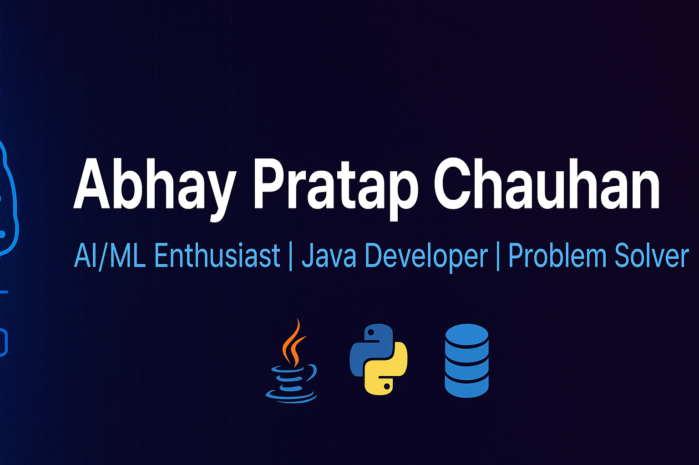

<!-- Banner -->

# Hi, I'm Abhay Pratap Chauhan 👋  

🚀 **AI/ML Enthusiast | Java Developer | Problem Solver**  

---

## 🧠 About Me  
- 🎯 Passionate about **Machine Learning, Deep Learning, and Data Structures**  
- 📚 Currently exploring **Natural Language Processing & AI Projects**  
- 💻 Skilled in **Java, SQL, Python, and C++**  
- 🏆 On a **100-Day LeetCode Challenge** — sharpening problem-solving skills  
- 🌱 Lifelong learner, always curious about the latest in tech  

---

## 🏆 GitHub Achievements  
  

---

## 🔬 Featured Projects  
📌 **[Face Mask Detection System](#)** — Real-time detection using CNN + OpenCV  
📌 **[Library Management System](#)** — Book management using Lists & Queues  
📌 **[Handwritten Digit Recognition](#)** — KNN, SVM, and Logistic Regression  
📌 **[Hybrid QA Model with BERT & T5](#)** — Enhanced performance on CoQA dataset  

---

## 🛠 Skills & Tools  

**Languages**  
  
  
  
  

**AI/ML**  
  
  
  
  

**Tools**  
  
  
  
  

---

## 📊 GitHub Stats  

  
  
  

---

## 📫 Connect With Me  

  
  

---

⭐ **Fun Fact:** I enjoy solving problems, learning new algorithms, and exploring AI like a curious child.  

---
